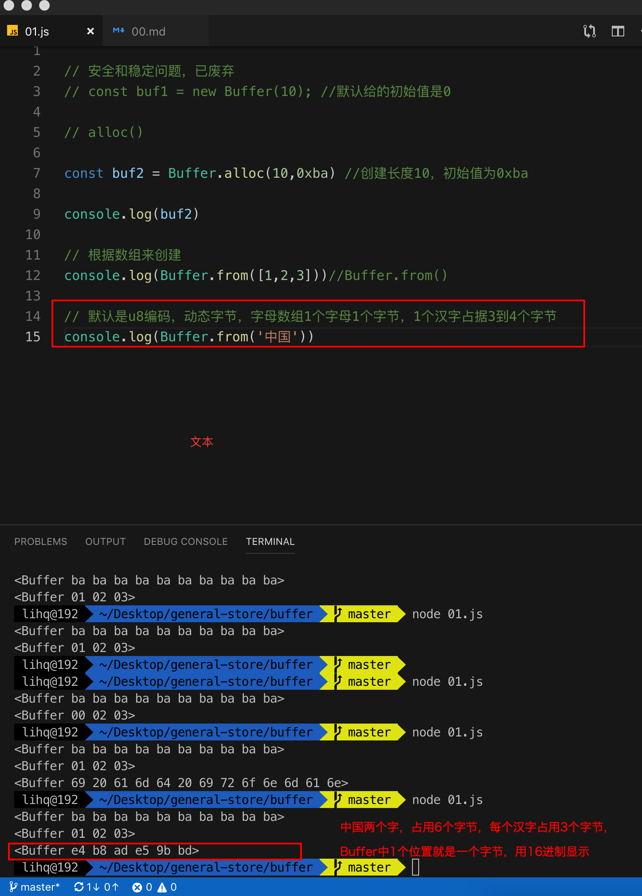

## Buffer

> 在TypeArray之前，js中没有任何机制来读取和操作二进制的流数据，在Nodejs中引入了Buffer这个类的引入来处理流数据,例如tcp,文件操作等等。

1. TypeArray是在es6才提出的，现在是可以使用的，但是在node端，Buffer实现了Uint8Array的API而且是经过优化的，所有在Node端使用Buffer比较合适

2. Buffer实例的创建 就好比是在堆内存中创建一个固定长度大小的数组，数组内存放的是整数

3. Buffer类是暴露到全局的，是不需要显示的引入就可以使用的

