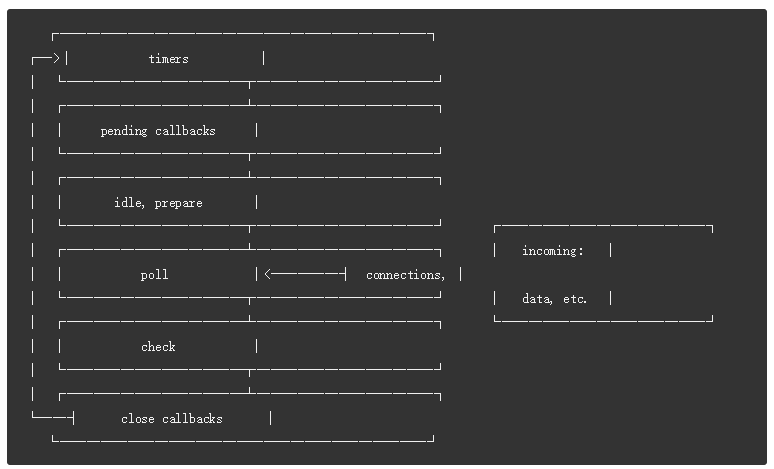

## event loop & timers & process.nextTick()

## event loop

> 事件循环是 nodejs 可以实现非阻塞io的基础，尽管js是单线程的。当nodejs启动的时候，初始化事件循环，执行js脚本，这些js脚本可能包含异步的api调用，定时器，或者precess.nextTick()，然后开始处理事件循环

> 事件循环的执行顺序如下

> **每个步骤都是一个事件循环的一个 阶段**

1. 每个阶段都要一个FIFO队列，这个队列存储待执行的回调函数， 尽管每个阶段都是各不相同的，但是总体来说，当事件循环进入到某个阶段的时候，它会执行特定的操作，接着这个阶段的回调函数直到队列为空或者已经执行了最大限度的回调函数量，然后事件循环进入下一个阶段

> 进入某一阶段 ===> 执行特定操作===>执行队列中的回调函数 ===>进入下一个阶段

2. 阶段概况
   1. timers: 这个阶段执行 回调函数 setTimeout() setInterval()
   2. pending callbacks: 执行IO回调函数
   3. idle, prepare: 内部执行
   4. poll: 获取新的IO事件，执行io相关的回调函数(除了close事件的回调), 执行timer回调，setImmediate()； node 会在此阶段阻塞当合适的时候
   5. check: setImmediate() 回调执行
   6. close callback: 执行close事件的回调

3. 在每次事件循环的之间，node会检查是否有 异步IO或者timer ，如果没有，就关闭event loop

> **阶段详情**
 
**timer**
> 一个timer指定一个时间阀值,在经过这个设定的时间阀值的时候，指定的回调函数可能会执行，并不能保证一定会执行。

**pending callbacks**
> 这个阶段 执行回调函数，这些回调函数都是系统的操作，例如tcp 错误

**poll**

> poll 阶段有两个主要的主要的功能

1. 计算该阻塞的时间，以及轮询IO的时间
2. 处理poll队列中的事件

> 当事件循环进入到poll阶段的时候，如果没有任何的定时器，分两种情况
1. 如果poll队列为不为空，事件循环会一起遍历执行队列中的回调函数，直到队列为空，或者系统的硬性上限达到了

2. 如果poll阶段的队列是空的，又会有两种情况发生
   1. 如果执行的js是在setImmediate()中，那么事件循环会结束poll阶段，进入到check阶段来执行这些js
   2. 如果js不是在setImmediate()中，那么事件循环会等待回调函数加入到队列中，然后执行

3. 一旦poll的队列是空的时候，就会检查timer定时器是否达到设置的时间，如果时间过了设定的值，那么事件循环就会绕回timer阶段取执行定时器的回调函数

**check**

